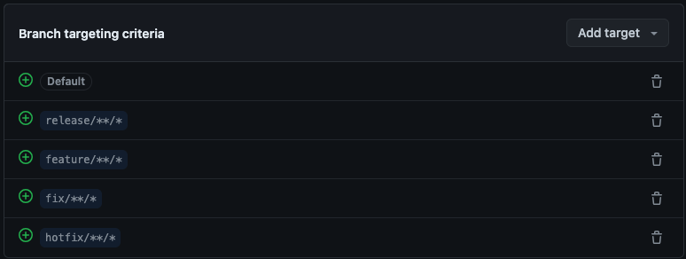

<div align="center">
<a id="readme-top"></a>
<!-- Header banner -->

<p align="center">

  <a>
    
  </a>
  <a>
    
  </a>
  <a>
    
  </a>
  <a>
    
  </a>
  <a>
    
  </a>
</p>

----

<p align="center">
  <a href="https://naver.com">
    
  </a>
</p>

<br/>

Sincerely, 에서 반려동물과 함께했던 추억을 
꽃으로 피워내며 숨겨왔던 감정을 편안하게 드러내보세요. 

온전히 감정을 표현하며 펫로스 증후군을 극복하도록 돕는 웹 서비스 
Sincerely,
<br/>
</div>

----

## Table of Contents

- [Introduction](#introduction)
- [Features](#features)
- [System Design and Documentation](#System-Design-and-Documentation)
- [Tech Stack](#Tech-Stack)
- [Contributors](#Contributors)
- [Acknowledgements](#Acknowledgements)

<div>

## Introduction 

## Features 
### 핵심 기능
<aside>

###  🙋 1. 질문을 제시하여 구체적으로 글을 쓰도록 유도합니다

> 펫로스 심리상담센터를 운영중인 김지훈 원장의 말에 따르면, “상실 이후에 경험할 수 있는 감정들을 온전하게 경험하는 것이 좋다” 고 하셨습니다. 온전한 감정을 경험하는 것을 돕기 위해 사용자에게 질문을 제시함으로써, 구체적으로 경험하는 감정들을 풀어낼 수 있게 유도합니다. <br/><br/>
> 반려동물과의 행복한 추억을 상기시킬 수 있는 질문 40개 중 하나를 선택하면, 질문에 맞게 글을 작성합니다. 이 과정에서 사용자는 질문에 답변을 하기 위해 구체적인 상황을 떠올리며 마음속 깊이 있었던 감정을 차근차근 풀어낸다. 
</aside>

### View
<aside>

###  🌿 2. 기록들을 카드 형식으로 모아볼 수 있는 기능

> - **프로젝트 생성 기능**
>    - 프로젝트 이름, 한 줄 소개, 진행 기간, 역할, 선택 이유를 작성하면 프로젝트가 생성돼요. (*사진 첨부는 선택)
> - **프로젝트 카드 모음 기능**
>    - 프로젝트 카드에는 프로젝트명, 진행 기간, 핵심 역량 태그가 포함되며, 전체 카드들을 모아볼 수 있는 페이지가 있어요.
>- **프로젝트 내 경험기록 카드 모음 기능**
>    - 경험 기록 카드에는 소제목, 경험한 날짜, 경험 태그가 포함되며, 프로젝트 카드 내에서 경험기록 카드를 생성하고 모아볼 수 있어요.
>- **경험기록 작성 기능**
>    - 소제목, 경험한 날짜, 경험 태그 및 질문에 대한 답변을 작성할 수 있어요.
</aside>


### Filtering
<aside>

###  🌿 3. 태그 필터링 및 단어 검색 기능

> - 핵심 역량 태그 및 경험 태그 필터링 기능과 단어 검색 기능을 통해 빠르고 쉽게 필요한 기록을 찾을 수 있어요!
</aside>


## System Design and Documentation

### License


----

### Commit Message
By default, create a commit using the icon in https://gitmoji.dev/.

```
:sparkles: Add login pages
:bug: Fix CORS Error
```

🚀 - Deploy stuff `:rocket:`

⚡ - Improve performance `:zap:`

🔥 - Remove code or files `:fire:`

🐛 - Fix a bug `:bug:`

✨ - Introduce new features `:sparkles:`

✅ - Add, Update `:white_check_mark:`

📝 - Add or update documentation `:memo:`    

:see_no_evil: - Add or update ignore `:see_no_evil:`

---

### Branch Criteria


## Tech Stack

## Contributors 

## Acknowledgements 
