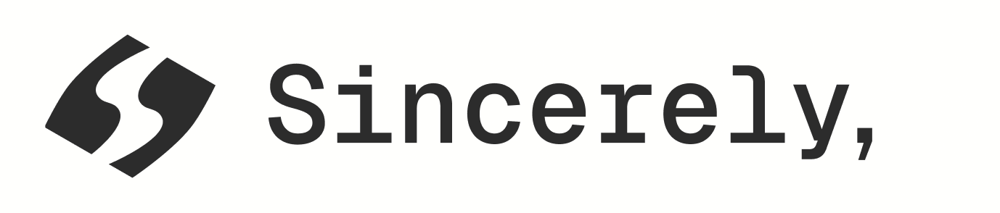
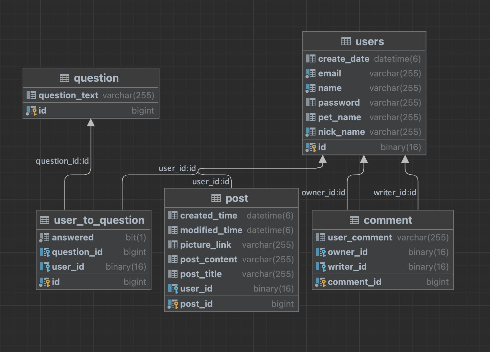
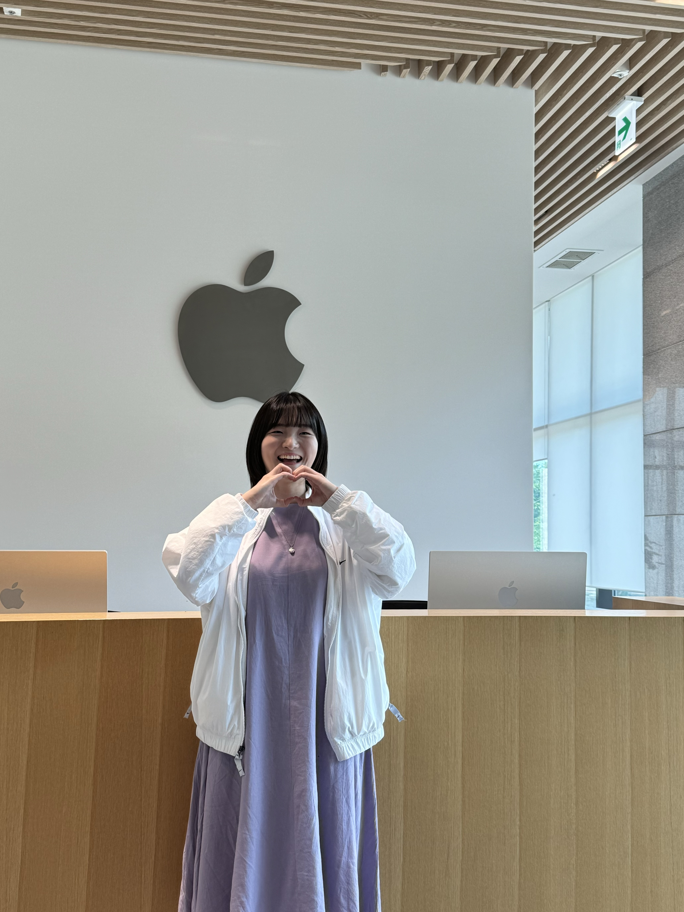
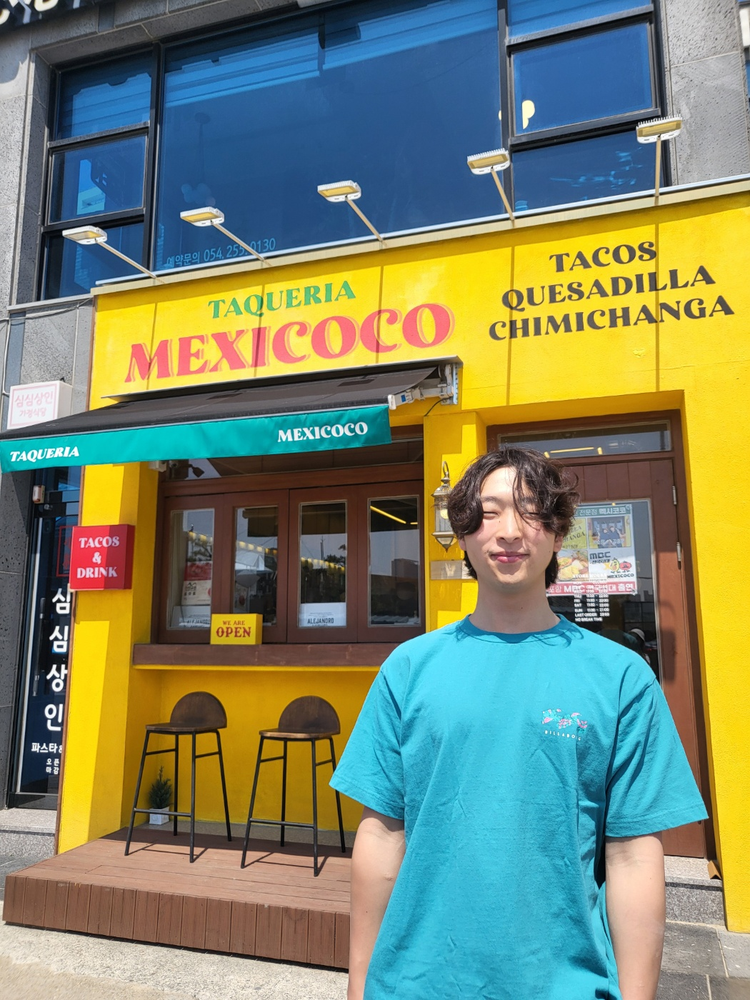
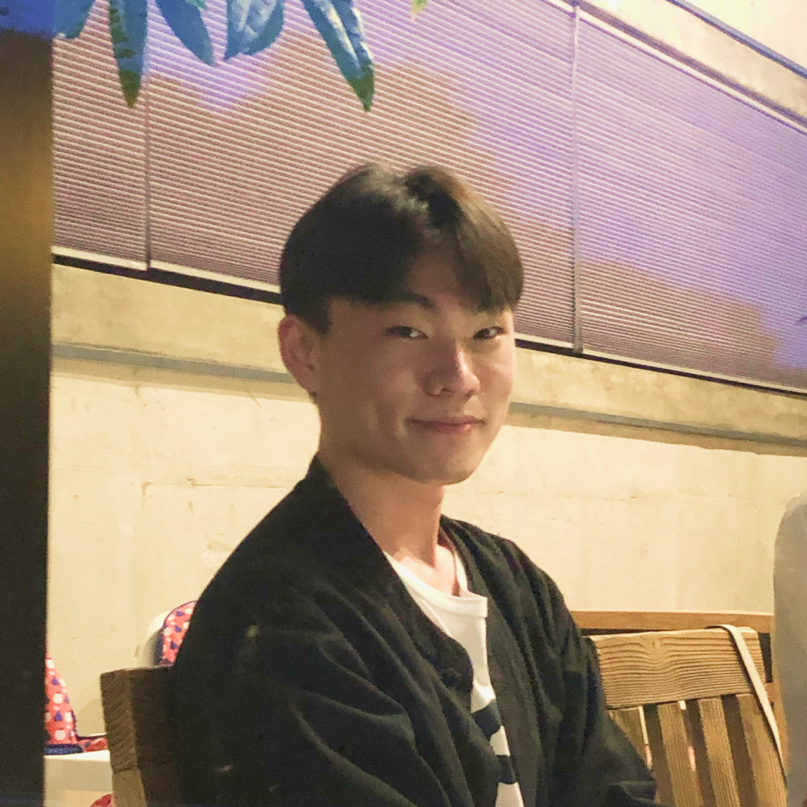
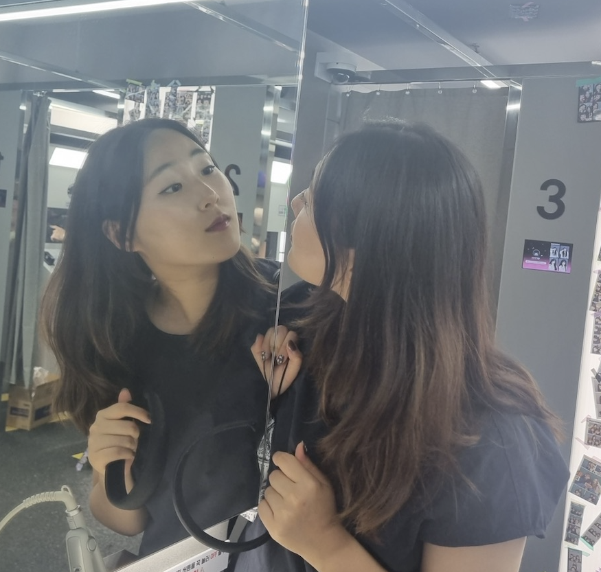
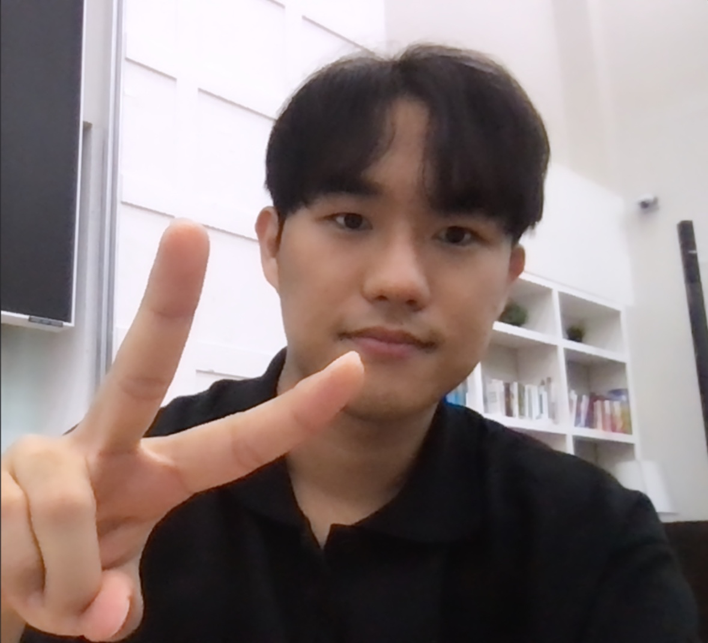
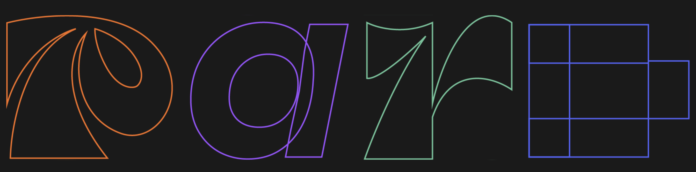

<!-- Header banner -->

  
  
  
  
  

----

  

 

Sincerely, 에서 반려동물과 함께했던 추억을 
꽃으로 피워내며 숨겨왔던 감정을 편안하게 드러내보세요. 

온전히 감정을 표현하며 펫로스 증후군을 극복하도록 돕는 웹 서비스 
Sincerely,
 

----

# 📗 Table of Contents

- [Introduction](#-Introduction)
- [Features](#-Features)
- [System Design and Documentation](#%EF%B8%8F-system-design-and-documentation)
- [Tech Stack](#-Tech-Stack)
- [Contributors](#-Contributors)
- [Acknowledgements](#-Acknowledgements)

# 📖 Introduction 
### 서비스명: Sincerely,
#### 펫로스 증후군을 겪는 반려인이 제시된 질문에 따라 본인의 감정을 글로 적으며, 억눌렀던 감정을 표현하도록 돕는 웹 서비스 입니다
> 💡 **Problem Definition:** 펫로스 증후군을 겪는 반려인은 감정을 억누르기 때문에 일상생활의 어려움을 겪습니다

### Sincerely, 를 통해 이를 해결하고자 합니다

| As-is | To-be |
| --- | --- |
| 감정이 너무 크다보니 심리적으로 해소하는 시작점에서 부담감을 느껴 회피하게 된다. | 질문을 제시하여 추억을 회상하는 것부터 시작하도록 돕는다. 슬픔에 정체되어 계속 머무르지 않게 만들기 |
| 어떤 방법을 쓰면 충분히 효과적으로 해소할 수 있는지 모른다. | 글쓰기라는 방법을 제시함으로써 글쓰는 과정에서 충분히 자신의 감정을 꺼낼 수 있도록 돕는다. |
| 슬퍼하다보니 못해줬다는 죄책감에 휩싸여 분노의 단계에 머무른다. | 행복한 추억을 가장 빠르게 시각화할 수 있는 사진을 올리게 함으로써 “반려동물이 자신과 함께 있으며 행복했다!”는 것을 인식하게 만들어준다. |

# 🚀 Features 
### 핵심 기능
<aside>

###  🙋 1. 질문을 제시하여 구체적으로 글을 쓰도록 유도합니다

> 펫로스 심리상담센터를 운영중인 김지훈 원장의 말에 따르면, “상실 이후에 경험할 수 있는 감정들을 온전하게 경험하는 것이 좋다” 고 하셨습니다. 온전한 감정을 경험하는 것을 돕기 위해 사용자에게 질문을 제시함으로써, 구체적으로 경험하는 감정들을 풀어낼 수 있게 유도합니다.   
> 반려동물과의 행복한 추억을 상기시킬 수 있는 질문 40개 중 하나를 선택하면, 질문에 맞게 글을 작성합니다. 이 과정에서 사용자는 질문에 답변을 하기 위해 구체적인 상황을 떠올리며 마음속 깊이 있었던 감정을 차근차근 풀어냅니다. 
</aside>

<aside>

###  📸 2. 질문에 맞는 사진을 올리게 유도하며 구체적인 회상을 돕습니다

> 질문을 선택한 뒤, 바로 사진을 업로드할 수 있게 하여 추억을 더 구체적이고 자세하게 회상할 수 있습니다.   
> 사진을 보고 반려동물과의 행복한 기억을 위주로 떠올리게 함으로써 ‘더 잘해줄 수 있었는데, 잘 못해줬다는 죄책감’ 에서 ‘이 친구도 나와 함께했던 시간이 행복했구나’ 로 감정을 전환시킵니다. 
</aside>

<aside>

###  🌷 3. 단기성으로 글을 작성하는 것이 아니라, 40개의 글을 작성하면 꽃밭이 채워진다는 장치를 시각화하여 글을 지속적으로 쓰도록 유도합니다

> 10개의 꽃이 채워질 때마다 기억의 꽃밭에 문구가 변화되고, 서비스를 사용하는 사용자에게 ‘슬퍼해도 된다’, ‘슬픈게 이상한 것이 아니다’ 는 메세지를 전달합니다.   
> Sincerely, 는 펫로스 증후군을 겪는 반려인들이 웹 페이지 안에서 만큼은 온전히 감정을 털어놓을 수 있게 도움으로써 짧은 시간 안에 충분히 슬픈 감정을 표현할 수 있습니다. 
</aside>

<aside>

###  📝 4. 추억을 남겼던 공간의 공개여부를 선택하게 함으로써 같은 처지에 있는 사람들과 공감할 수 있는 창구를 제공합니다

> 펫로스 증후군의 해결책 중 하나는 공감해줄 사람들과 지속적으로 교류하면서 이야기를 나누는 것입니다.
하지만 현재 펫로스 증후군을 겪는 사람들이 자주 사용하는 감정 해소 창구에는 공개여부에 대한 선택권이 없습니다.  
> - 블로그 - 프라이빗한 공간이지만, 같은 처지에 있는 사람들의 접근이 어렵습니다. (무조건 검색을 통해 들어오거나 사용자가 URL을 공유해야한다)
> - 카페 등 커뮤니티 - 공개적인 공간이지만, 글이 지속될수록 반응이 덜해지고 글을 올리려면 무조건 공개를 해야합니다.
>
> Sincerely,는 반려동물과의 추억이 담긴 공간의 공개여부를 사용자가 결정하게 만듦으로써 같은 처지에 있는 사람에게 공감받고 싶을 때 공개하고, 내가 슬퍼하는 것이 정상적이라는 것을 인식할 수 있도록 했습니다.  
</aside>

# 🗃️ System Design and Documentation
### ERD 

---

# 🛠 Tech Stack
## 👷 Built With
### Frontend

  
  
   
    
  
  
  

### Backend

  
  
  
  
  
  

### Cooperation 

  
  
  
  

 

# 👥 Contributors 
> 🌈 함께 만든 사람들 

|                                                🫠 Skylar (feat.SKRRR)                                                |                          👅 LJ                           |                          👾 Dojo                           |                          🐒 Mojo                           |
|:-----------------------------------------------------------------------------------------------------:|:---------------------------------------------------------:|:---------------------------------------------------------:|:---------------------------------------------------------:|
|                                                  PM                                                   |                            기획                             |                            백엔드                            |                            백엔드                            |
|    |     |  |  |
|                                                🎨 **Big Matt**  **(A.K.A Young Guevara)**                                                |                          🍑 **Che Che**                           |                          🧐 **Jojo  (Alias. dUmPlinG BoI)**                           |                          😶‍🌫️ **Yumin Nancy**                          |
|                                                  디자인                                                  |                           프론트엔드                           |                           프론트엔드                           |                           프론트엔드                           |
|  |  |  |  |

# 🙏 Acknowledgements 
> **This was made possible by**  
<a href="https://we-pard.com/" style="display:flex;flex-direction:column;">
  

<a/>

----

> “How lucky I am to have something that makes saying goodbye so hard.”  -Winnie the Pooh, The Adventures of Winnie the Pooh

----

### License

